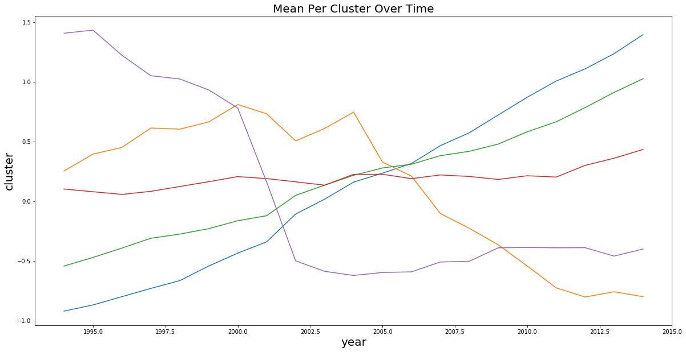

# ReadMe

# Time Series Clusters
This exploratory analysis uses K-means and Guassian Mixture to look at NYC development patterns over time. Mapping is done with geopandas package.

### sample output: 

