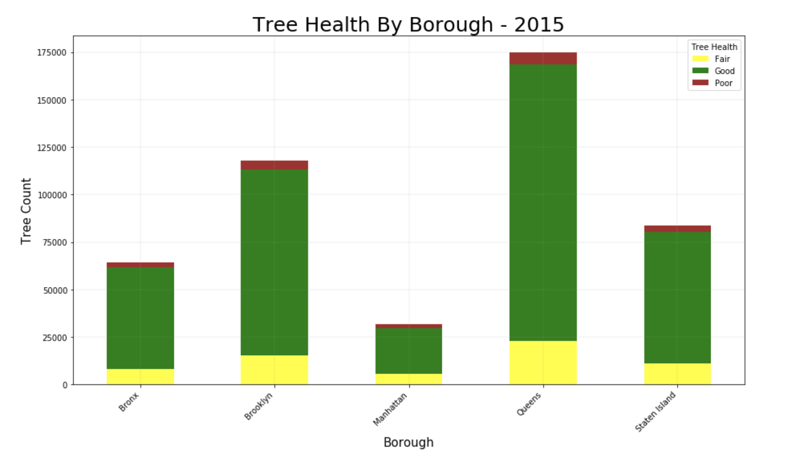
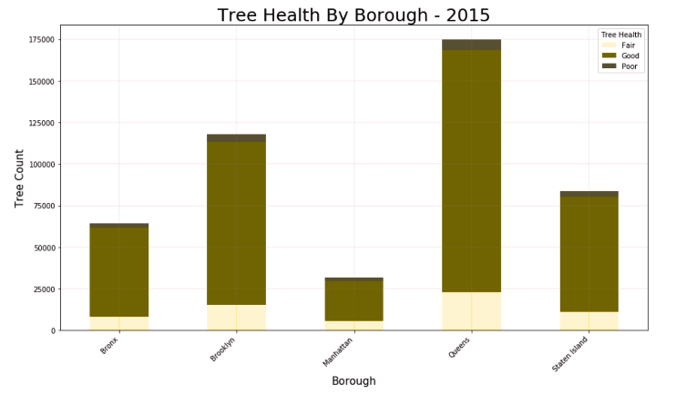

**Fig 1:** This image shows the count of trees in "Poor," "Average," and "Good" health in New York City's five boroughs, acoording to the 2015 Tree Census. From this chart, you can compare the number of total trees in each borough, and the health breakdown by color.

## Review:

#### CLARITY:
* This bar plot has every element needed (title, label, legend, axis) for readers to easily understand the content.
* As the values of trees in poor condition in five boroughs are relatively small and similar, and are stacked on the top, it seems a little difficult for readers to compare. One solution is to put the red bars on the bottom.
* Three types of colors are distinct and clear. Only concern is that color blind people have difficulty telling green and red apart. What they see might be like this:

**Fig 2:** This image shows the perception of Fig1 by color blind people. For them, red and green seem similar.
This figure is generated [here](http://www.color-blindness.com/coblis-color-blindness-simulator/).

#### AESTHETIC:
* The green represents health trees, yellow means fair, and warning color red means poor. The colors are consistent with our common sense color of good, fair, and poor.
* I might also recommend sorting these five bars ascending or descending by tree count so that it would be even easier to read.

#### HONESTY:
* The figure is honest in regard to the value because the y-axis starts from zero and records the absolute counts of trees.
