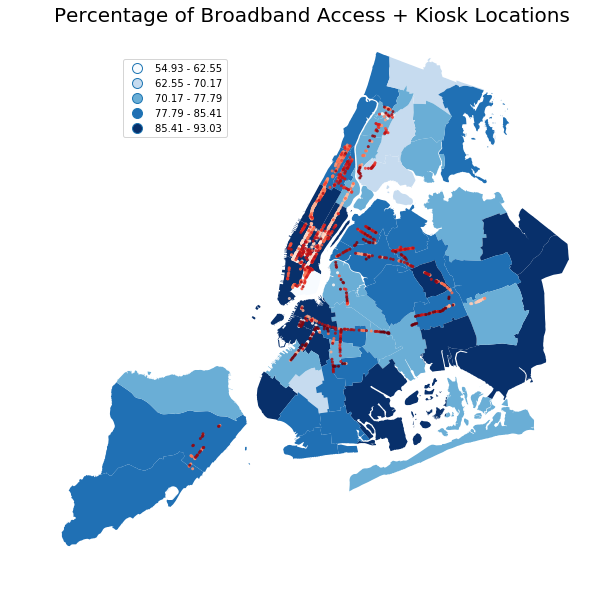
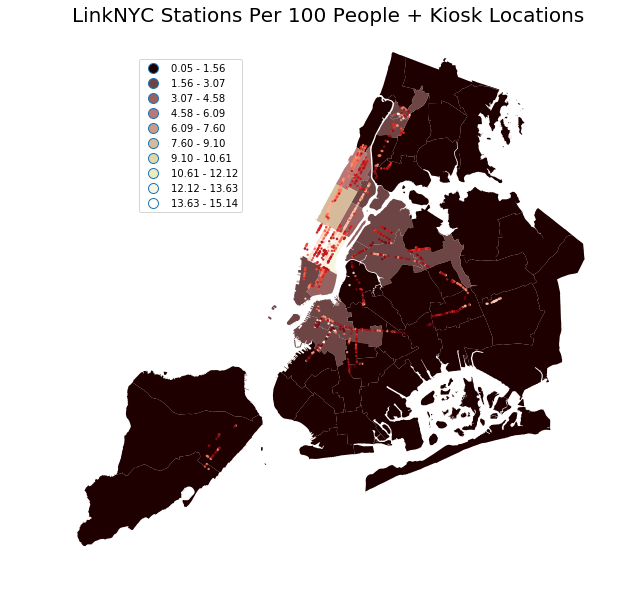

# Readme

#Scope 
This assignments uses **Shapely and Geopandas** to look at the **distribution of LinkNYC Wifi Hubs.** It uses data from both the **American Community Survey** and **NYC Open Data** to compare where the hubs are spatially, in relation to who has access to broadband internet access. 

---

**Resource:** Code from [GeopandasABCs](https://github.com/fedhere/PUI2017_fb55/blob/master/HW9_fb55/pandasGeospatialABC.ipynb) notebook 
